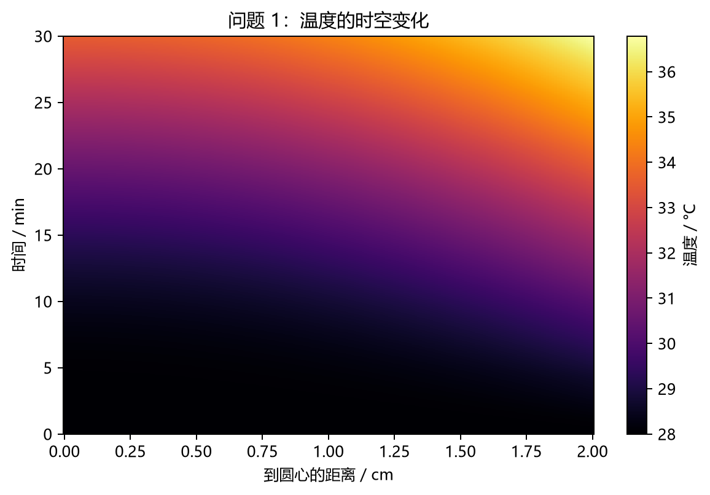
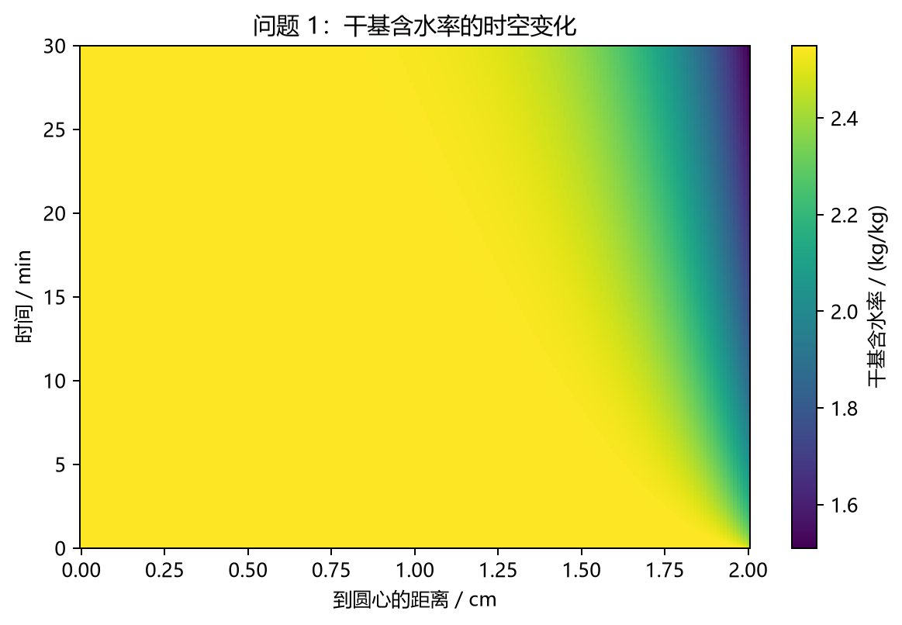
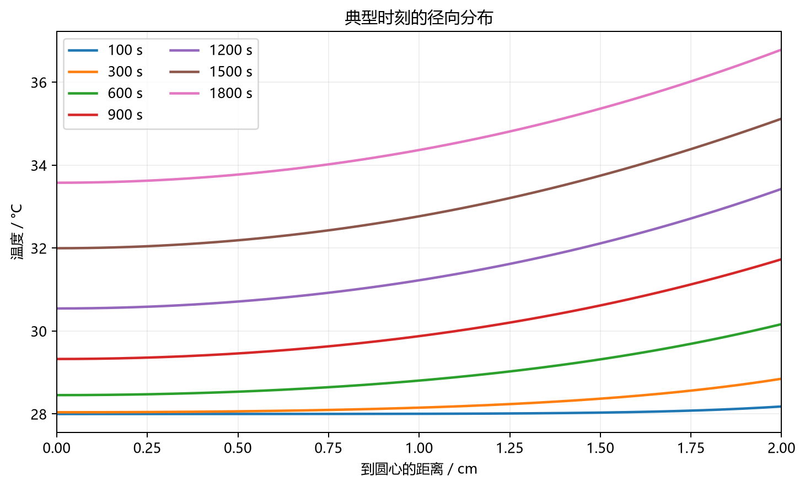
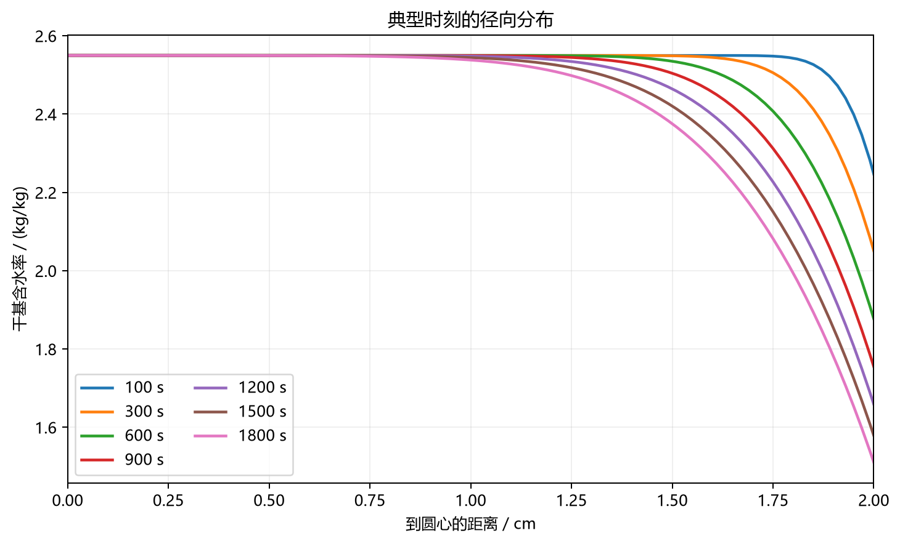
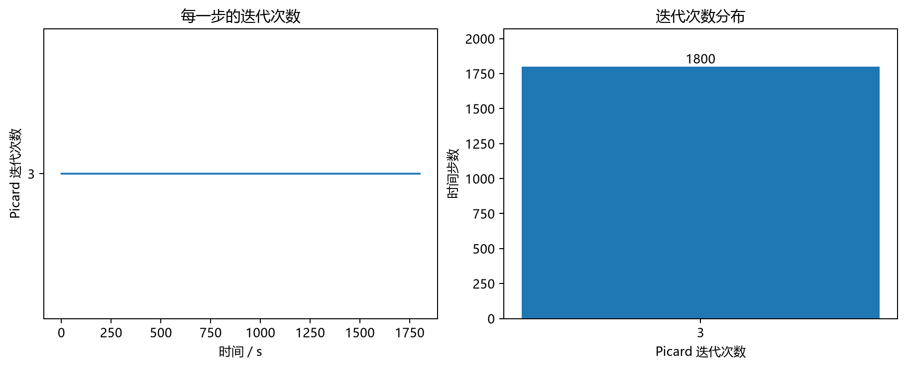
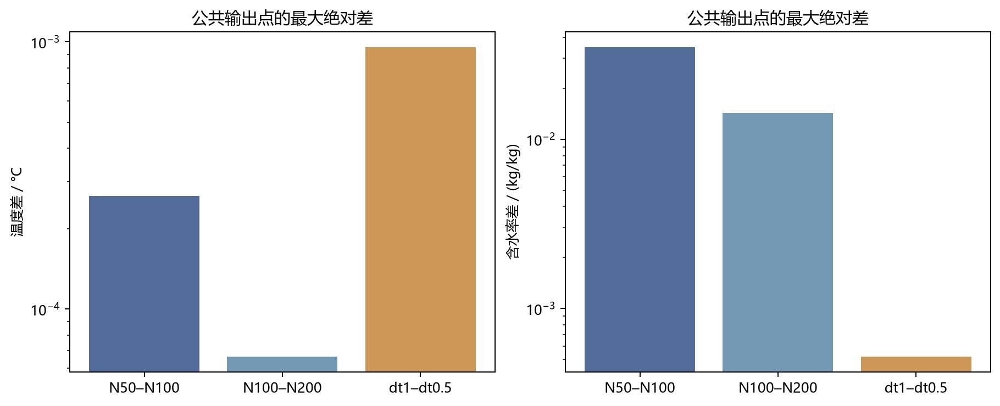

# 问题 1 数值结果与验证报告

默认结果：N=100，dt=1 s，时间 0–1800 s。计算和验证均使用双精度未舍入数据，题目表格及 result1.xlsx 保留四位小数。

## 模型和数值实现

仅使用用户指定的一维圆柱径向温度扩散与非线性水分扩散模型，无蒸发潜热、轴向传输或收缩项。温度与水分独立推进；D 仅依赖 C。

参数：R=0.02 m，rho=820 kg/m³，cp=2600 J/(kg·K)，k=0.36 W/(m·K)，hT=25 W/(m²·K)，hm=8e-7 m/s，T0=28 °C，C0=2.55 kg/kg；D(C)=7e-9 exp(-0.89/C) m²/s。没有参数拟合、裁剪或手工校正。

单元中心 r_i=(i+0.5)dr，V_i=(r_e²-r_w²)/2。内部面采用共享通量，水分面扩散系数为调和平均；圆心面的半径为零。后向 Euler 在新时刻取线性插值环境值；三对角系统由 scipy.linalg.solve_banded 求解。

温度表面等效系数为 1/(1/hT+dr/(2k))；水分表面等效系数为 1/(1/hm+dr/(2D_last))。Picard 从上一步 C 开始，每次重算 D、调和平均和表面等效系数，更新无穷范数严格小于 1e-9 才收敛，最多 50 次；失败会发出 RuntimeWarning 并记录失败时刻。

内部输出采用相邻单元中心线性插值；圆心采用 (9f0-f1)/8；表面由半单元扩散与对流串联公式重建，D_last 使用最终 C_last 计算。对于 (0,r_0) 的额外绘图位置，用对称二次函数；对于 (r_last,R)，连接末单元中心与真实表面值。

初始状态：t=0 保存全域 T0、C0。初始 C0 与环境 C_inf(0) 不同，初值与 Robin 边界在初始表面处不相容；从第一步起应用边界和表面重建，不改初值。Excel 模板要求从 t=1 开始，故填入 1–1800 s；NPZ 和 CSV 保留 t=0。

内部长度统一用 m；图表输出转为 cm。温度使用 °C，因为本问只涉及温差和梯度，与使用 K 完全等价。

## 附件读取

数据来源：`A题\A题\附件\附件1.xlsx`；SHA256：`7ef32870abeef420b89560b2530ff60dfe4255917805151d89988d0311af9dd7`。

共 241 个有效时刻，范围 0–14400 s。逐列检查数值有限、时间严格递增、水分非负；区间内线性插值，区间外报错。

## 表 1：药材温度 / °C

| 时间 / s | 0 cm | 0.5 cm | 1 cm | 1.5 cm | 2 cm |
|---:|---:|---:|---:|---:|---:|
| 100 | 28.0001 | 28.0004 | 28.0043 | 28.0333 | 28.1808 |
| 300 | 28.0416 | 28.0643 | 28.1523 | 28.3692 | 28.8499 |
| 600 | 28.4550 | 28.5377 | 28.8055 | 29.3172 | 30.1662 |
| 900 | 29.3262 | 29.4602 | 29.8771 | 30.6175 | 31.7314 |
| 1200 | 30.5446 | 30.7116 | 31.2240 | 32.1140 | 33.4287 |
| 1500 | 31.9974 | 32.1884 | 32.7675 | 33.7473 | 35.1209 |
| 1800 | 33.5765 | 33.7732 | 34.3653 | 35.3631 | 36.7863 |

## 表 2：药材干基含水率 / (kg/kg)

| 时间 / s | 0 cm | 0.5 cm | 1 cm | 1.5 cm | 2 cm |
|---:|---:|---:|---:|---:|---:|
| 100 | 2.5500 | 2.5500 | 2.5500 | 2.5500 | 2.2464 |
| 300 | 2.5500 | 2.5500 | 2.5500 | 2.5491 | 2.0506 |
| 600 | 2.5500 | 2.5500 | 2.5500 | 2.5350 | 1.8769 |
| 900 | 2.5500 | 2.5500 | 2.5497 | 2.5043 | 1.7547 |
| 1200 | 2.5500 | 2.5500 | 2.5481 | 2.4643 | 1.6586 |
| 1500 | 2.5500 | 2.5499 | 2.5445 | 2.4204 | 1.5788 |
| 1800 | 2.5500 | 2.5497 | 2.5382 | 2.3753 | 1.5103 |

## 数值收敛比较

在相同的 t=1,…,1800 s、r=0,0.1,…,2 cm 上比较，各网格均按相同规则重建中心和表面。以下差值来自未舍入结果，细网格/小时间步只是数值参照，不是解析真解。

| 比较 | 温度最大差 / °C | 温度 RMS / °C | 1800 s 温度最大差 | 含水率最大差 | 含水率 RMS | 1800 s 含水率最大差 |
|---|---:|---:|---:|---:|---:|---:|
| space_50_100 | 0.00026518039 | 0.00015075542 | 0.00023150335 | 0.034888405 | 0.00064373166 | 0.0005808674 |
| space_100_200 | 6.6489366e-05 | 4.7577216e-05 | 4.3090916e-05 | 0.014268776 | 0.00019767883 | 0.00017169242 |
| space_50_200 | 0.00033148145 | 0.00017820456 | 0.00021496401 | 0.049157181 | 0.00080670696 | 0.00072582937 |
| time_1_0.5 | 0.000954718 | 0.00064483791 | 0.00060009836 | 0.0005209664 | 3.0233755e-05 | 4.3920328e-05 |

N=100 与 200 的含水率最大差 0.014268776 kg/kg 出现在 t=1 s、r=2 cm；1800 s 最大差降至 0.00017169242 kg/kg。初始附近表面结果对空间分辨率更敏感。

相邻网格最大差之比（50–100 除以 100–200）：温度 3.9883，含水率 2.4451。比值大于 1 表示本次细化的最大差减小；初始边界不相容和表面输出重建可能影响全时域最大差的观测阶，不能只据三组网格断言严格二阶。

四位小数是提交格式，不代表已经证明四位小数的离散精度。dt=1 与 0.5 s 的比较只能量化时间步敏感性，未用它宣称时间收敛阶。

## 有限性、物理趋势及 Picard 检查

早期定义为 1–300 s。平均含水率为 sum(V_i C_i)/sum(V_i)，不是单元值算术平均。检查覆盖每个积分步，dt=0.5 s 的半秒状态也检查。

| N | dt / s | 有限性 | 平均 C 初值 → 末值 | 上升步数 (>1e-12) | 早期 Ts>Tc 比例 | 早期 Cs<Cc 比例 | Picard 最小/平均/最大 | 未收敛步数 |
|---:|---:|---|---|---:|---:|---:|---|---:|
| 100 | 1 | True | 2.55000000 → 2.29361782 | 0 | 100.00% | 100.00% | 3/3.0000/3 | 0 |
| 50 | 1.0 | True | 2.55000000 → 2.29375445 | 0 | 100.00% | 100.00% | 3/3.0000/3 | 0 |
| 200 | 1.0 | True | 2.55000000 → 2.29358371 | 0 | 100.00% | 100.00% | 3/3.9989/4 | 0 |
| 100 | 0.5 | True | 2.55000000 → 2.29361025 | 0 | 100.00% | 100.00% | 3/3.0000/3 | 0 |

默认网格温度范围：[28.00000000, 36.78630520] °C；含水率范围：[1.51032233, 2.55000000] kg/kg。

默认 Picard 次数分布：{'3': 1800}；最大最终更新量 9.511232e-10。逐步明细见 `picard_iterations.csv`，其他验证运行也分别保存逐步统计。

## 离散守恒核对

逐步计算 rho cp sum[V_i(T_new-T_old)]+dt R hT(T_s-T_inf) 与 sum[V_i(C_new-C_old)]+dt R hm(C_s-C_inf)。内部面通量应相消。这是离散代数守恒核对，不是完整物理能量或总水质量模型。

默认运行每步最大绝对热平衡残差：3.919975e-12 J/m（省略公共因子 2π）；最大含水率方程平衡残差：8.721792e-20 m²（C 视为质量比）。

水分平衡使用最终 C 重算 D_last，因此也检验 Picard 收敛后边界通量的一致性。

## 图形

## 文件与复现

`result1.xlsx`：按原模板两个工作表输出，1–1800 s、0–2 cm（步长 0.1 cm）。`table1_temperature.csv`、`table2_moisture.csv` 为题目两张表。

`fields_N100_dt1.npz`（默认命名）保存 times_s、r_centers_m、T_C、C_kg_kg、环境值、积分步、Picard 次数及结果采样场；保留双精度。`temperature_full.csv`、`moisture_full.csv` 保存 t=0–1800 s 的 21 个指定物理位置。

`convergence_metrics.json` 保存所有比较指标，`validation_checks.json` 保存各运行检查。图片同时提供 PNG 与 SVG。

运行方式见项目 `README_problem1.md`。程序不会覆盖附件或原始模板。